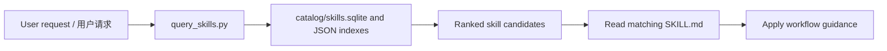
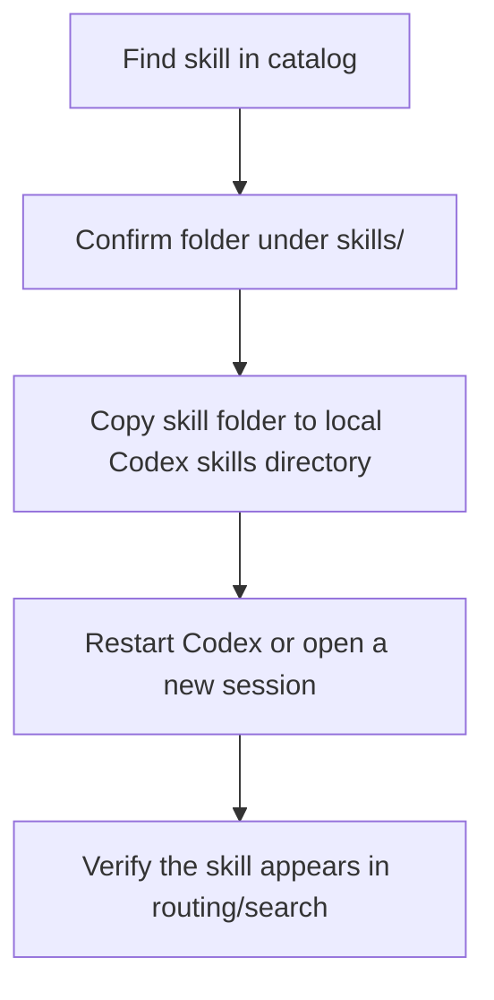

# Architecture / 架构

`superagentSkills` is organized around a simple loop: collect skills, generate a catalog, query by natural language, route to the best skill, and restore the skill locally when needed.

## Skills Source

The primary source is the repository `skills/` directory. Each installable skill folder should include `SKILL.md`.

The existing catalog builder can also scan local Codex skills and plugin-cache skills when those locations are available on a maintainer machine. Public CI must not require those private local caches to exist.

## Catalog Generation

`scripts/build_skill_catalog.py` scans available skill sources and writes generated catalog files under `catalog/`.

Common outputs include:

- `skills.json`
- `skills.jsonl`
- `skills.csv`
- `skills.sqlite`
- `preferred-skills.json`
- `keyword_index.json`
- `category_index.md`

Catalog files are useful for fast lookup and review, but the source of truth for installable behavior remains each skill's `SKILL.md`.

## Natural-Language Query Flow

The query flow should support English and Chinese trigger phrases. It should favor the user's intent, symptoms, desired output, and named tools over exact skill-name matching.

## Routing Logic

Routing follows this order:

1. Match task intent and symptoms.
2. Prefer process skills for planning, debugging, implementation, review, and verification.
3. Choose the most specific domain skill.
4. Prefer repository skills over duplicate local or plugin-cache copies.
5. Record missing trigger language as a future catalog improvement.

See [ROUTING_POLICY.md](ROUTING_POLICY.md).

## Local Restore Flow

Use placeholders in public docs for machine-specific restore paths. Maintainers may use local absolute paths in private notes, but public examples should avoid exposing private directories.

## Future Integrations

Codex is supported first. Cursor, Claude Code, and Gemini CLI are planned documentation targets only until a converter exists and is reviewed.

Future integration work should:

- preserve original skill content
- avoid lossy conversion
- keep generated files clearly marked
- avoid secrets and private paths
- include a validation path before claiming support
